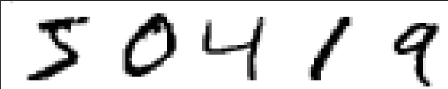

# Playground
深度学习新手小广场（机器视觉主题）

## 这个代码仓库有何用
如同学习其它任何新技能一样，掌握深度学习并无捷径可循。布满墨迹的A4纸张，屏幕上不断生长的代码，冒着呼呼热气的GPU，都是你成长道路上所付出努力的证明。

深度学习很复杂，涉及到的知识点范围跨度大，分布零散。从最基础的卷积算法到TensorFlow高阶API封装，每个知识点都仿佛一朵绽放的重瓣菊花，既可以向下深挖知识原理，又可以发散到不同的维度开启组合优化。新手入门，仿佛闯入布满镜子的迷宫，一眼望去到处是看不到尽头的知识，只知终点一定隐藏在迷宫深处。

但是，没有捷径并不意味着只能两眼一闭摸黑乱撞。走过迷宫的先驱者们或多或少都会留下探索的痕迹。跟随他们的脚印，踏实地走好每一步，是新手高效学习之光。

## 精选项目
跟随精选实战项目一步一步入门TensorFlow。

### 项目一：我的第一个神经网络
MNIST是一个由人类手写数字图像构成的数据集。它的作者为Yann LeCun、Corinna Cortes与Christopher J.C. Burges。该数据集曾被用作分类算法的开发与评估。给定任一张图像，给出该图像对应的数字。深度学习的入门教程普遍以该任务为实例。它足够简单——包含10个类别的图像分类问题；同时又足够复杂——人类手写的数字可以非常潦草、难以辨认。

这篇教程同样以MNIST为实验内容载体。不过与其它教程不同的地方在于，你将真正意义上从零开始，一步一步实现一个功能完备的深度学习项目。

项目配套互动视频：https://www.bilibili.com/video/BV17f4y167vJ/

项目地址：https://github.com/yinguobing/Playground/tree/main/MNIST_From_Zero_To_Hero

### 项目二：卷积神经网络
从超过20万张图像样本中学习人脸特征点的分布规律。克服姿态、光照、遮挡等不利因素。构建经典神经网络架构。最终实现头部姿态的视频实时检测。

### 项目三：物体检测（专题）
向经典的物体检测方案学习，掌握关键核心概念，理解深度卷积神经网络在检测方案中扮演的角色。

### 项目四：人脸识别（专题）
解开人脸识别原理的神秘面纱，了解技术链条中不同阶段的实现背景，获取98%+准确率的自有人脸识别模型。

## 迷你项目
探索众多迷你项目，点亮技能点。

### 模型拼接
掌握不同的模型构建方式，在项目中灵活应用。

### 从OpenImages数据集中提取人脸图像
项目遇到数据短缺问题，如何从现有的公开数据集中获取资源。

### 读写自定义TFRecord文件
高效存储读取训练用文件。

### 随机化大型数据集
使用大型数据集训练模型面临一个不可忽略的问题：如何有效地随机化数据。

### 使用Checkpoint保存训练进度
灵活使用Checkpoint，保存训练进度与自定义对象。

### 在训练过程中保存模型预测的图像
如何在训练进行中直观地检查模型表现。

### 模型剪枝（参数分布稀疏化）
如何大幅度减小模型体积，却只牺牲少量性能？

### 模型量化（参数范围离散化）
将你的模型移植到特殊的硬件设备中运行。

### 为Apple设备转换模型
为你的同事准备好一款让他们放心的模型。
